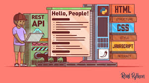

    
# FastAPI API Development Course Overview

Learn Python API development in one of the most comprehensive courses ever on the topic. This course guided me through building a full-fledged API in Python using FastAPI, a modern and fast web framework.

## What I Learned

- Fundamentals of API design, including routes, serialization/deserialization, schema validation, and models.
- Interaction with databases, specifically using SQL and Postgres.
- Testing your API using pytest.
- Building a CI/CD pipeline using GitHub Actions.
- Securing routes using JWT authentication.
- Containerizing the application using Docker.
- Deploying the API to production using Heroku and NGINX.

## Instructor: Sanjeev Thiyagarajan

Sanjeev Thiyagarajan is a seasoned software developer with a passion for teaching. He has a wealth of experience in web development and API design. Throughout the course, Sanjeev provides clear and practical explanations, making complex concepts easy to understand.

## Course Contents

The course covers the following topics:

- Introduction to FastAPI API development.
- Setting up your development environment on both Mac and Windows.
- Understanding Python virtual environments and installing dependencies.
- Building endpoints, handling HTTP requests, and validating input data with Pydantic.
- Performing CRUD operations and working with databases, specifically Postgres.
- Implementing authentication and securing routes with JWT tokens.
- Understanding SQL joins and relationships between database tables.
- Setting up a CI/CD pipeline with GitHub Actions for automated testing and deployment.
- Containerizing the API using Docker and deploying it to production on Heroku.
- Using NGINX for routing and enabling SSL/HTTPS for added security.

## Code Repository and Resources

The course's code repository can be found on [GitHub](https://github.com/Sanjeev-Thiyagarajan/fastapi-api-development-course). Be sure to check out the instructor's channel [Sanjeev Thiyagarajan](https://github.com/Sanjeev-Thiyagarajan) for more valuable content.

Whether you're new to API development or looking to expand your knowledge with FastAPI, this course is the perfect resource to master Python API development using FastAPI. Happy coding!
